# AskFlash System Architecture Diagram

**Created**: 2025-01-28  
**Status**: Current Production Architecture  
**Last Updated**: 2025-06-18 (Post Pydantic v2 fixes)

## Overview

This diagram represents the complete AskFlash system architecture, including all layers from client interfaces through to external services and infrastructure.

## Architecture Diagram

```mermaid
graph TB
    subgraph "Client Layer"
        WEB[🌐 Web Interface<br/>React.js App]
        TEAMS_CLIENT[👥 Microsoft Teams<br/>Client]
        WEB --> |Theme Toggle<br/>Mode Switch| UI[UI Components]
        UI --> CHAT[💬 Chat Component<br/>ChatGPT-like UI]
        UI --> SEARCH[🔍 Search Component]
    end
    
    subgraph "API Gateway Layer"
        FASTAPI[⚡ FastAPI Application<br/>main.py]
        CORS[🔗 CORS Middleware]
        ROUTES[📍 API Router<br/>api_v1/api.py]
        
        WEB --> FASTAPI
        TEAMS_CLIENT --> |Bot Framework| FASTAPI
        FASTAPI --> CORS
        FASTAPI --> ROUTES
    end
    
    subgraph "API Endpoints"
        CHAT_EP[💬 Chat Endpoints<br/>/api/v1/chat]
        TEAMS_EP[👥 Teams Endpoints<br/>/api/v1/teams]
        DOCS_EP[📚 Documentation<br/>/api/v1/docs]
        CONV_EP[💾 Conversations<br/>/api/v1/conversations]
        INTEG_EP[🔧 Integrations<br/>/integrations]
        EMBED_EP[🔢 Embeddings<br/>/api/v1/embeddings]
        MONITOR_EP[📊 Monitoring<br/>/api/v1/monitoring]
        
        ROUTES --> CHAT_EP
        ROUTES --> TEAMS_EP
        ROUTES --> DOCS_EP
        ROUTES --> CONV_EP
        ROUTES --> INTEG_EP
        ROUTES --> EMBED_EP
        ROUTES --> MONITOR_EP
    end
    
    subgraph "Core AI Services"
        STREAMING_AI[🧠 Streaming AI Service<br/>61KB - Primary Engine]
        INTENT_AI[🎯 Intent AI Service<br/>GPT-3.5 Meta-Cognitive]
        QUALITY_AI[✅ Information Quality Analyzer<br/>24KB - Conflict Detection]
        
        STREAMING_AI --> |Intent Analysis| INTENT_AI
        STREAMING_AI --> |Quality Check| QUALITY_AI
        INTENT_AI --> |Guidance| STREAMING_AI
        QUALITY_AI --> |Analysis| STREAMING_AI
    end
    
    subgraph "Business Logic Services"
        CONV_MGR[💾 Conversation Manager<br/>Persistence Logic]
        TEAMS_BOT[👥 Teams Bot Service<br/>Bot Framework Handler]
        DOC_SERVICE[📖 Enhanced Documentation<br/>Advanced Search + Aliases]
        ALIAS_DISCOVERY[🔍 Smart Alias Discovery<br/>Pattern Detection]
        VECTOR_SERVICE[🔢 Vector Store Service<br/>Qdrant Interface]
        AZURE_SERVICE[☁️ Azure DevOps Service<br/>Wiki Integration]
    end
    
    subgraph "Data Processing Layer"
        EMBED_PROC[🔢 Embedding Processor<br/>all-MiniLM-L6-v2]
        SEARCH_ENGINE[🔍 Search Engine<br/>Semantic + Keyword]
        CONFLICT_DETECTOR[⚠️ Conflict Detector<br/>Cross-Reference Analysis]
        
        DOC_SERVICE --> EMBED_PROC
        DOC_SERVICE --> SEARCH_ENGINE
        QUALITY_AI --> CONFLICT_DETECTOR
    end
    
    subgraph "Integration Layer"
        INTEG_MGR[🔧 Integration Manager<br/>Multi-Source Handler]
        AZURE_CLIENT[☁️ Azure DevOps Client<br/>✅ Active]
        GITHUB_CLIENT[🐙 GitHub Client<br/>🔧 Placeholder]
        NOTION_CLIENT[📝 Notion Client<br/>🔧 Placeholder]
        
        INTEG_MGR --> AZURE_CLIENT
        INTEG_MGR --> GITHUB_CLIENT
        INTEG_MGR --> NOTION_CLIENT
    end
    
    subgraph "Database Layer"
        POSTGRES[(🐘 PostgreSQL 13<br/>Primary Database)]
        QDRANT[(🔢 Qdrant Vector DB<br/>Semantic Search)]
        
        subgraph "PostgreSQL Tables"
            USER_TBL[👤 Users]
            CONV_TBL[💬 Conversations]
            MSG_TBL[💬 Messages]
            RULESET_TBL[📋 Rulesets]
            INTEG_TBL[🔧 Integrations]
            WIKI_TBL[📖 Wiki Index]
        end
        
        POSTGRES --> USER_TBL
        POSTGRES --> CONV_TBL
        POSTGRES --> MSG_TBL
        POSTGRES --> RULESET_TBL
        POSTGRES --> INTEG_TBL
        POSTGRES --> WIKI_TBL
    end
    
    subgraph "External Services"
        OPENAI[🤖 OpenAI API<br/>GPT-4 + GPT-3.5]
        BOT_FRAMEWORK[🤖 Microsoft Bot Framework<br/>Teams Integration]
        AZURE_DEVOPS[☁️ Azure DevOps<br/>Wiki Source]
        GITHUB_EXT[🐙 GitHub<br/>External Repos]
        NOTION_EXT[📝 Notion<br/>External Docs]
    end
    
    subgraph "Infrastructure"
        DOCKER[🐳 Docker Compose]
        BACKEND_CONTAINER[📦 Backend Container<br/>FastAPI + Services]
        FRONTEND_CONTAINER[📦 Frontend Container<br/>React Dev Server]
        DB_CONTAINER[📦 PostgreSQL Container]
        QDRANT_CONTAINER[📦 Qdrant Container]
        ADMINER_CONTAINER[📦 Adminer Container<br/>DB Admin]
        
        DOCKER --> BACKEND_CONTAINER
        DOCKER --> FRONTEND_CONTAINER
        DOCKER --> DB_CONTAINER
        DOCKER --> QDRANT_CONTAINER
        DOCKER --> ADMINER_CONTAINER
    end
    
    %% Service Connections
    CHAT_EP --> STREAMING_AI
    TEAMS_EP --> TEAMS_BOT
    DOCS_EP --> DOC_SERVICE
    CONV_EP --> CONV_MGR
    INTEG_EP --> INTEG_MGR
    EMBED_EP --> VECTOR_SERVICE
    
    TEAMS_BOT --> STREAMING_AI
    DOC_SERVICE --> ALIAS_DISCOVERY
    DOC_SERVICE --> VECTOR_SERVICE
    AZURE_SERVICE --> INTEG_MGR
    
    %% Database Connections
    CONV_MGR --> POSTGRES
    STREAMING_AI --> POSTGRES
    TEAMS_BOT --> POSTGRES
    DOC_SERVICE --> POSTGRES
    VECTOR_SERVICE --> QDRANT
    INTEG_MGR --> POSTGRES
    
    %% External Service Connections
    STREAMING_AI --> OPENAI
    INTENT_AI --> OPENAI
    TEAMS_BOT --> BOT_FRAMEWORK
    AZURE_CLIENT --> AZURE_DEVOPS
    GITHUB_CLIENT --> GITHUB_EXT
    NOTION_CLIENT --> NOTION_EXT
    
    %% Infrastructure Connections
    BACKEND_CONTAINER --> POSTGRES
    BACKEND_CONTAINER --> QDRANT
    FRONTEND_CONTAINER --> BACKEND_CONTAINER
    
    %% Data Flow Highlights
    classDef primary fill:#7ed321,stroke:#333,stroke-width:3px,color:#000
    classDef active fill:#27ae60,stroke:#333,stroke-width:2px,color:#fff
    classDef placeholder fill:#95a5a6,stroke:#333,stroke-width:1px,color:#fff
    classDef ai fill:#3498db,stroke:#333,stroke-width:2px,color:#fff
    classDef data fill:#e74c3c,stroke:#333,stroke-width:2px,color:#fff
    
    class STREAMING_AI,FASTAPI,CHAT primary
    class AZURE_CLIENT,AZURE_DEVOPS,DOC_SERVICE active
    class GITHUB_CLIENT,NOTION_CLIENT,GITHUB_EXT,NOTION_EXT placeholder
    class INTENT_AI,QUALITY_AI,OPENAI ai
    class POSTGRES,QDRANT data
```

## Architecture Layers Explained

### 🎨 **Client Layer**
- **Web Interface**: Modern React.js application with ChatGPT-like UI
- **Microsoft Teams**: Native Teams client integration via Bot Framework
- **UI Components**: Theme switching, mode selection, responsive design

### ⚡ **API Gateway Layer** 
- **FastAPI Application**: High-performance async Python web framework
- **CORS Middleware**: Cross-origin resource sharing for web client
- **API Router**: Centralized routing with v1 API versioning

### 🔌 **API Endpoints**
- **Chat**: Core conversation functionality with streaming
- **Teams**: Microsoft Teams Bot Framework webhook handlers
- **Documentation**: Advanced document search and indexing
- **Conversations**: Persistent conversation management
- **Integrations**: Multi-source integration configuration
- **Embeddings**: Vector operations and semantic search
- **Monitoring**: System health and performance metrics

### 🧠 **Core AI Services**
- **Streaming AI**: Primary 61KB service with dual-AI architecture
- **Intent AI**: GPT-3.5 powered meta-cognitive conversation analysis
- **Quality AI**: 24KB conflict detection and information validation

### 🏢 **Business Logic Services**
- **Conversation Manager**: Full persistence with message metadata
- **Teams Bot Service**: Adaptive Cards and rich Teams messaging
- **Enhanced Documentation**: 26KB advanced search with alias discovery
- **Smart Alias Discovery**: 20KB pattern detection and relationship mapping
- **Vector Store Service**: Qdrant interface with semantic operations
- **Azure DevOps Service**: Wiki integration and content processing

### 🔍 **Data Processing Layer**
- **Embedding Processor**: all-MiniLM-L6-v2 model for semantic vectors
- **Search Engine**: Combined semantic and keyword search capabilities
- **Conflict Detector**: Cross-reference analysis and quality scoring

### 🔧 **Integration Layer**
- **Integration Manager**: Multi-source configuration and orchestration
- **Azure DevOps Client**: ✅ Active - Full wiki integration
- **GitHub Client**: 🔧 Placeholder implementation
- **Notion Client**: 🔧 Placeholder implementation

### 💾 **Database Layer**
- **PostgreSQL 13**: Primary relational database for structured data
- **Qdrant Vector DB**: High-performance vector similarity search
- **Schema**: Users, Conversations, Messages, Rulesets, Integrations, Wiki Index

### 🌐 **External Services**
- **OpenAI API**: GPT-4 and GPT-3.5-turbo for AI processing
- **Microsoft Bot Framework**: Teams integration and messaging
- **Azure DevOps**: Active source for company documentation
- **GitHub/Notion**: Planned future integrations

### 🐳 **Infrastructure**
- **Docker Compose**: Multi-container orchestration
- **Backend Container**: FastAPI application with all services
- **Frontend Container**: React.js development server
- **Database Containers**: PostgreSQL and Qdrant with persistent volumes
- **Admin Tools**: Adminer for database administration

## Color Coding Legend

- **🟢 Primary (Flash Green #7ed321)**: Core system components
- **🟢 Active (Success Green)**: Production-ready, fully implemented
- **⚫ Placeholder (Gray)**: Implemented but disabled/placeholder
- **🔵 AI (Blue)**: AI and machine learning services
- **🔴 Data (Red)**: Database and data storage components

## Usage Instructions

This diagram can be rendered in:
- **GitHub**: Automatically renders Mermaid diagrams in markdown
- **Mermaid Live Editor**: Copy the code to https://mermaid.live/
- **VS Code**: With Mermaid preview extensions
- **Confluence/Notion**: Many tools support Mermaid diagram imports
- **Documentation Sites**: Most modern documentation platforms

## Maintenance

This diagram should be updated when:
- New services are added or removed
- Integration status changes (placeholder → active)
- Major architectural changes occur
- New external services are integrated
- Database schema significantly changes

---

*This diagram represents the production architecture as of 2025-06-18, including all recent Pydantic v2 compatibility fixes and integration refactoring improvements.* 