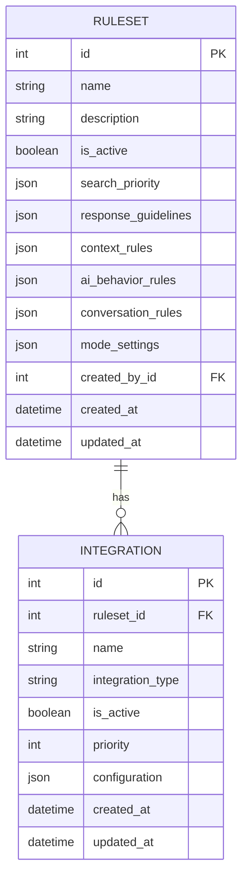

# AskFlash Ruleset Integration Refactoring Plan

**Date:** 2025-01-27  
**Status:** Planning Phase  
**Priority:** High - Architecture Improvement  
**Impact:** Breaking Change - Requires Migration

## Problem Analysis

### Current Rigid Implementation

The current `ruleset` table has individual columns for each integration type:
- `notion_config` (JSON)
- `azure_devops_config` (JSON) 
- `github_config` (JSON)
- `dynatrace_config` (JSON)

### Problems with Current Approach

1. **Scaling Issues**: Adding new integrations requires new database columns and schema changes
2. **Single Integration Limitation**: Can't connect to multiple wikis/sources of the same type with one ruleset
3. **Configuration Rigidity**: Configuration is hardcoded in the database schema
4. **Future-Proofing**: Unknown future integrations can't be added without schema migrations
5. **Code Complexity**: Services need to check each individual `*_config` column

### Current Usage Analysis

From code investigation, the `*_config` columns are used in:
- `DocumentationService._initialize_azure_client()` - Only Azure DevOps is actively used
- `insert_default_ruleset.py` - Sets up default configurations
- Various endpoint handlers for Azure DevOps API calls
- Notion, GitHub, and Dynatrace configs are largely placeholders/disabled

## Proposed Solution: Relational Integration Architecture

### New Database Schema



### Integration Types (Extensible)

- `azure_devops_wiki`
- `azure_devops_repos` 
- `notion_database`
- `notion_pages`
- `github_repos`
- `github_wiki`
- `dynatrace_logs`
- `confluence_spaces`
- `sharepoint_sites`
- *Future integrations can be added without schema changes*

## Implementation Plan

### Phase 1: Database Schema Migration

#### Step 1.1: Create New Table

```sql
-- Integration table
CREATE TABLE integration (
    id SERIAL PRIMARY KEY,
    ruleset_id INTEGER NOT NULL REFERENCES ruleset(id) ON DELETE CASCADE,
    name VARCHAR(255) NOT NULL,
    integration_type VARCHAR(100) NOT NULL,
    is_active BOOLEAN NOT NULL DEFAULT TRUE,
    priority INTEGER NOT NULL DEFAULT 100,
    configuration JSONB NOT NULL DEFAULT '{}',
    created_at TIMESTAMP NOT NULL DEFAULT NOW(),
    updated_at TIMESTAMP NOT NULL DEFAULT NOW(),
    
    CONSTRAINT uq_integration_name_per_ruleset UNIQUE(ruleset_id, name)
);

-- Indexes for performance
CREATE INDEX idx_integration_ruleset_id ON integration(ruleset_id);
CREATE INDEX idx_integration_type ON integration(integration_type);
CREATE INDEX idx_integration_active ON integration(is_active);
CREATE INDEX idx_integration_priority ON integration(priority);
```

#### Step 1.2: Data Migration Script

```python
# backend/scripts/migrate_integrations.py
"""
Migration script to move from *_config columns to integration table
"""
import asyncio
import json
from sqlalchemy.ext.asyncio import AsyncSession
from sqlalchemy.future import select
from app.core.database import async_session_factory
from app.models.ruleset import Ruleset
from app.models.integration import Integration, IntegrationConfig

async def migrate_existing_integrations():
    """Migrate existing *_config columns to integration table"""
    
    async with async_session_factory() as session:
        # Get all existing rulesets
        result = await session.execute(select(Ruleset))
        rulesets = result.scalars().all()
        
        for ruleset in rulesets:
            print(f"Migrating integrations for ruleset: {ruleset.name}")
            
            # Migrate Azure DevOps config
            if ruleset.azure_devops_config:
                await _migrate_azure_devops_config(session, ruleset)
            
            # Migrate Notion config (if not disabled)
            if ruleset.notion_config:
                await _migrate_notion_config(session, ruleset)
            
            # Migrate GitHub config (if not empty)
            if ruleset.github_config and ruleset.github_config != "{}":
                await _migrate_github_config(session, ruleset)
            
            # Migrate Dynatrace config (if not disabled)
            if ruleset.dynatrace_config:
                await _migrate_dynatrace_config(session, ruleset)
        
        await session.commit()
        print("Migration completed successfully!")

async def _migrate_azure_devops_config(session: AsyncSession, ruleset: Ruleset):
    """Migrate Azure DevOps configuration"""
    azure_config = json.loads(ruleset.azure_devops_config) if isinstance(ruleset.azure_devops_config, str) else ruleset.azure_devops_config
    
    if azure_config.get("disabled"):
        return  # Skip disabled integrations
    
    # Create integration with full configuration (excluding sensitive values)
    integration = Integration(
        ruleset_id=ruleset.id,
        name="Flash Azure DevOps Wiki",
        integration_type="azure_devops_wiki",
        is_active=True,
        priority=1,
        configuration={
            "organization": azure_config.get("organization"),
            "project": azure_config.get("project"),
            "wiki_id": azure_config.get("wiki_id"),
            # Note: PAT will be read from environment variable AZURE_DEVOPS_PAT
        }
    )
    session.add(integration)

async def _migrate_notion_config(session: AsyncSession, ruleset: Ruleset):
    """Migrate Notion configuration"""
    notion_config = json.loads(ruleset.notion_config) if isinstance(ruleset.notion_config, str) else ruleset.notion_config
    
    if notion_config.get("disabled"):
        return  # Skip disabled integrations
    
    integration = Integration(
        ruleset_id=ruleset.id,
        name="Notion Documentation",
        integration_type="notion_database",
        is_active=True,
        priority=2,
        configuration={
            "database_id": notion_config.get("database_id"),
            # Note: API key will be read from environment variable NOTION_API_KEY
        }
    )
    session.add(integration)

# Similar functions for GitHub and Dynatrace...

if __name__ == "__main__":
    asyncio.run(migrate_existing_integrations())
```

### Phase 2: Model Refactoring

#### Step 2.1: New SQLAlchemy Models

```python
# backend/app/models/integration.py
from sqlalchemy import Column, String, Integer, ForeignKey, JSON, Boolean
from sqlalchemy.orm import relationship
from app.models.base import Base, TimestampMixin
from typing import Dict, Any, List, Optional
import os

class Integration(Base, TimestampMixin):
    """Integration model for external service connections"""
    __tablename__ = 'integration'
    __table_args__ = {'schema': 'public'}
    
    name = Column(String, nullable=False)
    integration_type = Column(String, nullable=False)
    is_active = Column(Boolean, default=True, nullable=False)
    priority = Column(Integer, default=100, nullable=False)
    configuration = Column(JSON, nullable=False, default={})  # All non-sensitive configuration
    
    # Relationships
    ruleset_id = Column(Integer, ForeignKey('public.ruleset.id'), nullable=False)
    ruleset = relationship("Ruleset", back_populates="integrations")
    
    def get_config_value(self, key: str, default=None):
        """Get configuration value from configuration JSON or environment"""
        # First check configuration JSON
        if self.configuration and key in self.configuration:
            return self.configuration[key]
        
        # For sensitive values, check environment variables
        # Pattern: {INTEGRATION_TYPE}_{KEY} (e.g., AZURE_DEVOPS_WIKI_PAT)
        env_key = f"{self.integration_type.upper()}_{key.upper()}"
        env_value = os.getenv(env_key)
        if env_value:
            return env_value
        
        # Fallback for integration-specific environment variables
        # Pattern: INTEGRATION_{ID}_{KEY} (e.g., INTEGRATION_1_PAT)
        specific_env_key = f"INTEGRATION_{self.id}_{key.upper()}"
        specific_env_value = os.getenv(specific_env_key)
        if specific_env_value:
            return specific_env_value
        
        return default
    
    def get_full_config(self) -> Dict[str, Any]:
        """Get complete configuration dictionary including environment values"""
        config = dict(self.configuration or {})
        
        # Add common sensitive keys from environment
        sensitive_keys = self._get_sensitive_keys_for_type()
        for key in sensitive_keys:
            env_value = self.get_config_value(key)
            if env_value:
                config[key] = env_value
        
        return config
    
    def get_public_config(self) -> Dict[str, Any]:
        """Get configuration without sensitive values (for API responses)"""
        config = dict(self.configuration or {})
        
        # Add placeholder for sensitive keys that exist in environment
        sensitive_keys = self._get_sensitive_keys_for_type()
        for key in sensitive_keys:
            env_value = self.get_config_value(key)
            if env_value:
                config[key] = "[FROM_ENVIRONMENT]"
        
        return config
    
    def _get_sensitive_keys_for_type(self) -> List[str]:
        """Get list of sensitive configuration keys for this integration type"""
        sensitive_map = {
            "azure_devops_wiki": ["pat"],
            "notion_database": ["api_key"],
            "github_repos": ["token"],
            "dynatrace_logs": ["api_token"]
        }
        return sensitive_map.get(self.integration_type, [])
    
    def __repr__(self):
        return f"<Integration {self.name} ({self.integration_type})>"
```

#### Step 2.2: Update Ruleset Model

```python
# backend/app/models/ruleset.py - Updates
class Ruleset(Base, TimestampMixin):
    # ... existing fields remain the same ...
    
    # DEPRECATED: Mark old integration columns for removal
    # notion_config = Column(JSON)  # DEPRECATED - Remove after migration
    # azure_devops_config = Column(JSON)  # DEPRECATED - Remove after migration
    # github_config = Column(JSON)  # DEPRECATED - Remove after migration
    # dynatrace_config = Column(JSON)  # DEPRECATED - Remove after migration
    
    # NEW: Relationship to integrations
    integrations = relationship("Integration", back_populates="ruleset", cascade="all, delete-orphan")
    
    def get_active_integrations(self, integration_type: str = None) -> List['Integration']:
        """Get active integrations, optionally filtered by type"""
        integrations = [i for i in self.integrations if i.is_active]
        
        if integration_type:
            integrations = [i for i in integrations if i.integration_type == integration_type]
        
        # Sort by priority (lower number = higher priority)
        return sorted(integrations, key=lambda x: x.priority)
    
    def get_integration_by_name(self, name: str) -> Optional['Integration']:
        """Get integration by name"""
        return next((i for i in self.integrations if i.name == name), None)
    
    def get_search_priority_integrations(self) -> List['Integration']:
        """Get integrations ordered by search priority"""
        # Parse search_priority if it contains integration names
        if isinstance(self.search_priority, list):
            # Old format: ["azure_devops", "notion", "github"]
            type_priority = {type_name: idx for idx, type_name in enumerate(self.search_priority)}
            
            active_integrations = self.get_active_integrations()
            
            # Sort by type priority, then by integration priority
            return sorted(active_integrations, key=lambda x: (
                type_priority.get(x.integration_type, 999),
                x.priority
            ))
        
        # Default: sort by integration priority
        return self.get_active_integrations()
```

### Phase 3: Service Layer Refactoring

#### Step 3.1: Update Documentation Service

```python
# backend/app/services/documentation.py - Major refactoring
class DocumentationService:
    """Service for handling documentation source integrations"""
    
    def __init__(self, ruleset: Ruleset, db):
        self.ruleset = ruleset
        self.db = db
        self.integration_clients = {}
        self.vector_store = VectorStoreService()
        
        # Initialize clients for active integrations
        self._initialize_integration_clients()
    
    def _initialize_integration_clients(self):
        """Initialize clients for all active integrations"""
        for integration in self.ruleset.get_active_integrations():
            try:
                client_info = self._create_integration_client(integration)
                if client_info:
                    self.integration_clients[integration.name] = client_info
                    logger.info(f"✅ Initialized client for {integration.name}")
                    
            except Exception as e:
                logger.error(f"❌ Failed to initialize {integration.name}: {str(e)}")
    
    def _create_integration_client(self, integration: Integration) -> Optional[Dict]:
        """Create client for specific integration type"""
        if integration.integration_type == "azure_devops_wiki":
            return self._create_azure_devops_client(integration)
        elif integration.integration_type == "notion_database":
            return self._create_notion_client(integration)
        elif integration.integration_type == "github_repos":
            return self._create_github_client(integration)
        else:
            logger.warning(f"Unknown integration type: {integration.integration_type}")
            return None
    
    def _create_azure_devops_client(self, integration: Integration) -> Dict:
        """Create Azure DevOps client for specific integration"""
        config = integration.get_full_config()
        
        required_fields = ["organization", "project", "wiki_id", "pat"]
        missing = [f for f in required_fields if not config.get(f)]
        if missing:
            raise ValueError(f"Azure DevOps integration '{integration.name}' missing: {', '.join(missing)}")
        
        # Use existing AzureDevOpsClient or create new one
        from app.services.azure_devops import AzureDevOpsClient
        
        client = AzureDevOpsClient(
            organization=config["organization"],
            project=config["project"],
            pat=config["pat"]
        )
        
        # Test connection
        try:
            client._get_wiki_details()  # This will throw if connection fails
        except Exception as e:
            raise ValueError(f"Failed to connect to Azure DevOps: {str(e)}")
        
        return {
            "client": client,
            "type": "azure_devops_wiki",
            "config": config,
            "integration": integration
        }
    
    def _create_notion_client(self, integration: Integration) -> Dict:
        """Create Notion client for specific integration"""
        config = integration.get_full_config()
        
        required_fields = ["api_key", "database_id"]
        missing = [f for f in required_fields if not config.get(f)]
        if missing:
            raise ValueError(f"Notion integration '{integration.name}' missing: {', '.join(missing)}")
        
        # Initialize Notion client (when implemented)
        # client = NotionClient(auth=config["api_key"])
        
        return {
            "client": None,  # Placeholder until Notion is implemented
            "type": "notion_database",
            "config": config,
            "integration": integration
        }
    
    async def search_documentation(self, query: str, limit: int = 10) -> List[DocumentationSource]:
        """Search across all active integrations based on priority"""
        all_results = []
        
        # Get integrations in priority order
        priority_integrations = self.ruleset.get_search_priority_integrations()
        
        for integration in priority_integrations:
            if integration.name not in self.integration_clients:
                continue
            
            client_info = self.integration_clients[integration.name]
            
            try:
                if client_info["type"] == "azure_devops_wiki":
                    results = await self._search_azure_devops(client_info, query, limit)
                elif client_info["type"] == "notion_database":
                    results = await self._search_notion(client_info, query, limit)
                # Add more integration types...
                else:
                    continue
                
                # Tag results with integration info
                for result in results:
                    result.integration_name = integration.name
                    result.integration_type = integration.integration_type
                
                all_results.extend(results)
                
            except Exception as e:
                logger.error(f"Search failed for {integration.name}: {str(e)}")
        
        # Sort by relevance score and return top results
        all_results.sort(key=lambda x: x.relevance_score, reverse=True)
        return all_results[:limit]
    
    # Update existing search methods to work with client_info structure
    async def _search_azure_devops(self, client_info: Dict, query: str, limit: int) -> List[DocumentationSource]:
        """Search Azure DevOps wiki using the client"""
        client = client_info["client"]
        config = client_info["config"]
        
        # Use existing Azure DevOps search logic but with new client structure
        try:
            search_results = client.search_wiki(query)
            # Convert to DocumentationSource objects
            sources = []
            for result in search_results[:limit]:
                source = DocumentationSource(
                    name=result.get("title", ""),
                    type="azure_devops_wiki",
                    url=self._construct_azure_devops_wiki_url(result.get("path", ""), config),
                    title=result.get("title", ""),
                    content=result.get("content", ""),
                    relevance_score=result.get("score", 0.0),
                    last_updated=result.get("lastUpdated", datetime.utcnow())
                )
                sources.append(source)
            return sources
        except Exception as e:
            logger.error(f"Azure DevOps search error: {str(e)}")
            return []
```

### Phase 4: API Endpoints Enhancement

#### Step 4.1: Integration Management Endpoints

```python
# backend/app/api/api_v1/endpoints/integrations.py
from fastapi import APIRouter, Depends, HTTPException, status
from sqlalchemy.ext.asyncio import AsyncSession
from sqlalchemy.future import select
from typing import List, Optional
from app.core.database import get_db
from app.core.auth import get_current_user
from app.models.user import User
from app.models.ruleset import Ruleset
from app.models.integration import Integration, IntegrationConfig
from app.schemas.integration import (
    IntegrationResponse,
    IntegrationCreateRequest,
    IntegrationUpdateRequest,
    IntegrationTestResponse
)

router = APIRouter()

@router.get("/rulesets/{ruleset_id}/integrations", response_model=List[IntegrationResponse])
async def get_ruleset_integrations(
    ruleset_id: int,
    integration_type: Optional[str] = None,
    active_only: bool = True,
    current_user: User = Depends(get_current_user),
    db: AsyncSession = Depends(get_db)
):
    """Get integrations for a ruleset"""
    
    # Get ruleset
    ruleset = await db.get(Ruleset, ruleset_id)
    if not ruleset:
        raise HTTPException(status_code=404, detail="Ruleset not found")
    
    # Filter integrations
    integrations = ruleset.get_active_integrations(integration_type) if active_only else ruleset.integrations
    
    return [
        IntegrationResponse(
            id=integration.id,
            name=integration.name,
            integration_type=integration.integration_type,
            is_active=integration.is_active,
            priority=integration.priority,
            config=integration.get_public_config(),  # Hide sensitive values
            created_at=integration.created_at,
            updated_at=integration.updated_at
        )
        for integration in integrations
    ]

@router.post("/rulesets/{ruleset_id}/integrations", response_model=IntegrationResponse)
async def create_integration(
    ruleset_id: int,
    integration_data: IntegrationCreateRequest,
    current_user: User = Depends(get_current_user),
    db: AsyncSession = Depends(get_db)
):
    """Create new integration for ruleset"""
    
    # Verify ruleset exists
    ruleset = await db.get(Ruleset, ruleset_id)
    if not ruleset:
        raise HTTPException(status_code=404, detail="Ruleset not found")
    
    # Check for duplicate name
    existing = ruleset.get_integration_by_name(integration_data.name)
    if existing:
        raise HTTPException(status_code=400, detail="Integration name already exists")
    
    # Create integration
    integration = Integration(
        ruleset_id=ruleset_id,
        name=integration_data.name,
        integration_type=integration_data.integration_type,
        is_active=integration_data.is_active,
        priority=integration_data.priority,
        base_config=integration_data.base_config
    )
    
    db.add(integration)
    await db.flush()  # Get ID
    
    # Add sensitive configurations
    for key, value in integration_data.sensitive_config.items():
        config = IntegrationConfig(
            integration_id=integration.id,
            config_key=key,
            config_value=value,
            is_sensitive=True
        )
        db.add(config)
    
    await db.commit()
    await db.refresh(integration)
    
    return IntegrationResponse(
        id=integration.id,
        name=integration.name,
        integration_type=integration.integration_type,
        is_active=integration.is_active,
        priority=integration.priority,
        config=integration.get_public_config(),
        created_at=integration.created_at,
        updated_at=integration.updated_at
    )

@router.put("/integrations/{integration_id}", response_model=IntegrationResponse)
async def update_integration(
    integration_id: int,
    integration_data: IntegrationUpdateRequest,
    current_user: User = Depends(get_current_user),
    db: AsyncSession = Depends(get_db)
):
    """Update integration configuration"""
    
    integration = await db.get(Integration, integration_id)
    if not integration:
        raise HTTPException(status_code=404, detail="Integration not found")
    
    # Update basic fields
    if integration_data.name is not None:
        integration.name = integration_data.name
    if integration_data.is_active is not None:
        integration.is_active = integration_data.is_active
    if integration_data.priority is not None:
        integration.priority = integration_data.priority
    if integration_data.base_config is not None:
        integration.base_config = integration_data.base_config
    
    # Update sensitive configurations
    if integration_data.sensitive_config:
        for key, value in integration_data.sensitive_config.items():
            # Find existing config or create new
            existing_config = next((c for c in integration.configs if c.config_key == key), None)
            if existing_config:
                existing_config.config_value = value
            else:
                new_config = IntegrationConfig(
                    integration_id=integration.id,
                    config_key=key,
                    config_value=value,
                    is_sensitive=True
                )
                db.add(new_config)
    
    await db.commit()
    await db.refresh(integration)
    
    return IntegrationResponse(
        id=integration.id,
        name=integration.name,
        integration_type=integration.integration_type,
        is_active=integration.is_active,
        priority=integration.priority,
        config=integration.get_public_config(),
        created_at=integration.created_at,
        updated_at=integration.updated_at
    )

@router.delete("/integrations/{integration_id}")
async def delete_integration(
    integration_id: int,
    current_user: User = Depends(get_current_user),
    db: AsyncSession = Depends(get_db)
):
    """Delete integration"""
    
    integration = await db.get(Integration, integration_id)
    if not integration:
        raise HTTPException(status_code=404, detail="Integration not found")
    
    await db.delete(integration)
    await db.commit()
    
    return {"message": "Integration deleted successfully"}

@router.post("/integrations/{integration_id}/test", response_model=IntegrationTestResponse)
async def test_integration(
    integration_id: int,
    current_user: User = Depends(get_current_user),
    db: AsyncSession = Depends(get_db)
):
    """Test integration connectivity"""
    
    integration = await db.get(Integration, integration_id)
    if not integration:
        raise HTTPException(status_code=404, detail="Integration not found")
    
    # Test connection based on integration type
    try:
        if integration.integration_type == "azure_devops_wiki":
            success, message = await _test_azure_devops_integration(integration)
        elif integration.integration_type == "notion_database":
            success, message = await _test_notion_integration(integration)
        # Add more integration types...
        else:
            success, message = False, f"Testing not implemented for {integration.integration_type}"
        
        return IntegrationTestResponse(
            success=success,
            message=message,
            tested_at=datetime.utcnow()
        )
        
    except Exception as e:
        return IntegrationTestResponse(
            success=False,
            message=f"Test failed: {str(e)}",
            tested_at=datetime.utcnow()
        )

async def _test_azure_devops_integration(integration: Integration) -> tuple[bool, str]:
    """Test Azure DevOps integration connectivity"""
    try:
        config = integration.get_full_config()
        
        # Create client and test connection
        from app.services.azure_devops import AzureDevOpsClient
        client = AzureDevOpsClient(
            organization=config["organization"],
            project=config["project"],
            pat=config["pat"]
        )
        
        wiki_details = client._get_wiki_details()
        if wiki_details:
            return True, f"Successfully connected to wiki {config['wiki_id']}"
        else:
            return False, "Could not retrieve wiki details"
            
    except Exception as e:
        return False, f"Connection failed: {str(e)}"
```

#### Step 4.2: Enhanced Ruleset Endpoints

```python
# backend/app/api/api_v1/endpoints/rulesets.py - Enhanced version
from fastapi import APIRouter, Depends, HTTPException
from sqlalchemy.ext.asyncio import AsyncSession
from typing import List, Dict, Any
from app.core.database import get_db
from app.core.auth import get_current_user
from app.models.user import User
from app.models.ruleset import Ruleset
from app.schemas.ruleset import RulesetResponse, RulesetCreateRequest
from app.services.documentation import DocumentationService

router = APIRouter()

@router.get("/", response_model=List[RulesetResponse])
async def get_rulesets(
    current_user: User = Depends(get_current_user),
    db: AsyncSession = Depends(get_db)
):
    """Get all rulesets with integration counts"""
    
    result = await db.execute(select(Ruleset))
    rulesets = result.scalars().all()
    
    return [
        RulesetResponse(
            id=ruleset.id,
            name=ruleset.name,
            description=ruleset.description,
            is_active=ruleset.is_active,
            integration_count=len(ruleset.integrations),
            active_integration_count=len(ruleset.get_active_integrations()),
            created_at=ruleset.created_at,
            updated_at=ruleset.updated_at
        )
        for ruleset in rulesets
    ]

@router.post("/rulesets/{ruleset_id}/test-all-integrations")
async def test_all_integrations(
    ruleset_id: int,
    current_user: User = Depends(get_current_user),
    db: AsyncSession = Depends(get_db)
) -> Dict[str, Any]:
    """Test connectivity for all integrations in a ruleset"""
    
    ruleset = await db.get(Ruleset, ruleset_id)
    if not ruleset:
        raise HTTPException(status_code=404, detail="Ruleset not found")
    
    # Initialize documentation service (this tests all integrations)
    try:
        doc_service = DocumentationService(ruleset, db)
        
        test_results = []
        for integration in ruleset.get_active_integrations():
            if integration.name in doc_service.integration_clients:
                test_results.append({
                    "integration_name": integration.name,
                    "integration_type": integration.integration_type,
                    "status": "success",
                    "message": "Connection successful"
                })
            else:
                test_results.append({
                    "integration_name": integration.name,
                    "integration_type": integration.integration_type,
                    "status": "failed",
                    "message": "Failed to initialize client"
                })
        
        success_count = sum(1 for result in test_results if result["status"] == "success")
        
        return {
            "total_integrations": len(test_results),
            "successful_connections": success_count,
            "failed_connections": len(test_results) - success_count,
            "results": test_results
        }
        
    except Exception as e:
        raise HTTPException(status_code=500, detail=f"Failed to test integrations: {str(e)}")
```

### Phase 5: Pydantic Schemas

```python
# backend/app/schemas/integration.py
from pydantic import BaseModel, Field
from typing import Dict, Any, Optional
from datetime import datetime

class IntegrationResponse(BaseModel):
    id: int
    name: str
    integration_type: str
    is_active: bool
    priority: int
    configuration: Dict[str, Any]  # Public config (sensitive values shown as [FROM_ENVIRONMENT])
    created_at: datetime
    updated_at: datetime
    
    class Config:
        from_attributes = True

class IntegrationCreateRequest(BaseModel):
    name: str = Field(..., min_length=1, max_length=255)
    integration_type: str = Field(..., min_length=1, max_length=100)
    is_active: bool = True
    priority: int = Field(default=100, ge=1, le=1000)
    configuration: Optional[Dict[str, Any]] = None
    # Note: Sensitive values (PATs, API keys) should be set in environment variables

class IntegrationUpdateRequest(BaseModel):
    name: Optional[str] = Field(None, min_length=1, max_length=255)
    is_active: Optional[bool] = None
    priority: Optional[int] = Field(None, ge=1, le=1000)
    configuration: Optional[Dict[str, Any]] = None
    # Note: Sensitive values must be updated via environment variables

class IntegrationTestResponse(BaseModel):
    success: bool
    message: str
    tested_at: datetime
```

## Migration Strategy

### Phase A: Preparation (Zero Downtime)
1. ✅ Create new table (`integration`)
2. ✅ Add new models and relationships
3. ✅ Create migration script (test in staging)
4. ✅ Update services to work with both old and new structure (backward compatibility)
5. ✅ Update environment variable documentation

### Phase B: Migration Execution (Brief Maintenance Window)
1. 🔄 Run data migration script to populate new tables
2. 🔄 Validate migrated data integrity
3. 🔄 Update application to use new structure exclusively
4. 🔄 Mark old columns as deprecated (keep for rollback)

### Phase C: Cleanup (No Downtime)
1. 🚀 Remove old `*_config` columns from ruleset table
2. 🚀 Remove deprecated code paths
3. 🚀 Update documentation and API references

## Benefits After Implementation

### Immediate Benefits
1. **Multiple Integrations**: Connect to multiple Azure DevOps wikis, GitHub repos, etc.
2. **Dynamic Configuration**: Add new integration types without schema changes
3. **Granular Control**: Enable/disable individual integrations independently
4. **Priority Management**: Fine-tune integration search order and weight
5. **Security**: Sensitive values externalized to environment variables (.env file)
6. **Simplified Architecture**: Only 2 tables instead of 3, easier to understand and maintain

### Long-term Benefits
1. **Integration Marketplace**: Easy addition of new integration types (Confluence, SharePoint, etc.)
2. **Per-Integration Monitoring**: Track performance and usage per integration
3. **Role-Based Access**: Different users can access different integrations (future)
4. **Integration Templates**: Predefined configurations for common setups

### Developer Experience
1. **Cleaner Code**: No more checking individual `*_config` columns
2. **Type Safety**: Proper models for integration configuration
3. **Testing**: Easy to test individual integrations
4. **Debugging**: Clear separation of integration concerns

## Example Usage After Refactoring

### Multiple Azure DevOps Wikis
```python
# Database: Multiple integrations per ruleset
integrations = [
    {
        "name": "SRE DevOps Wiki",
        "type": "azure_devops_wiki", 
        "configuration": {
            "organization": "flashmobilevending",
            "project": "SRE-DevOPS",
            "wiki_id": "SRE-DevOPS.wiki"
        },
        "priority": 1
    },
    {
        "name": "Product Documentation",
        "type": "azure_devops_wiki",
        "configuration": {
            "organization": "flashmobilevending", 
            "project": "ProductDocs",
            "wiki_id": "ProductDocs.wiki"
        },
        "priority": 2
    }
]
```

### Mixed Integration Types
```python
# Database: Different integration types in one ruleset
integrations = [
    {
        "name": "Tech Wiki",
        "type": "azure_devops_wiki",
        "configuration": {
            "organization": "flashmobilevending",
            "project": "SRE-DevOPS", 
            "wiki_id": "SRE-DevOPS.wiki"
        },
        "priority": 1
    },
    {
        "name": "API Documentation", 
        "type": "github_repos",
        "configuration": {
            "owner": "flashmobilevending",
            "repo": "api-docs"
        },
        "priority": 2
    },
    {
        "name": "User Guides",
        "type": "notion_database",
        "configuration": {
            "database_id": "abc123def456"
        },
        "priority": 3
    }
]
```

### Environment Variable Setup (.env file)
```bash
# Local development - sensitive values in .env
AZURE_DEVOPS_WIKI_PAT=your_azure_pat_token_here
NOTION_DATABASE_API_KEY=your_notion_key_here
GITHUB_REPOS_TOKEN=your_github_token_here

# For multiple integrations of same type, use integration ID:
INTEGRATION_1_PAT=pat_for_first_azure_devops
INTEGRATION_2_PAT=pat_for_second_azure_devops
```

### API Usage Examples
```bash
# Get all integrations for a ruleset
GET /api/v1/rulesets/1/integrations

# Create new Azure DevOps integration
POST /api/v1/rulesets/1/integrations
{
  "name": "Secondary Wiki",
  "integration_type": "azure_devops_wiki",
  "configuration": {
    "organization": "flashmobilevending",
    "project": "AnotherProject",
    "wiki_id": "AnotherProject.wiki"
  },
  "priority": 2
}
# Note: PAT is read from AZURE_DEVOPS_WIKI_PAT environment variable

# Test all integrations
POST /api/v1/rulesets/1/test-all-integrations
```

## Implementation Timeline

### Week 1: Database Schema & Models
- ✅ Create Alembic migration for new tables
- ✅ Create SQLAlchemy models (`Integration`, `IntegrationConfig`)
- ✅ Update `Ruleset` model with relationships
- ✅ Write and test data migration script

### Week 2: Service Layer Updates  
- 🔄 Refactor `DocumentationService` for new architecture
- 🔄 Update integration initialization logic
- 🔄 Test with existing Azure DevOps integration
- 🔄 Maintain backward compatibility

### Week 3: API Endpoints & Testing
- 🚀 Create integration management endpoints
- 🚀 Create Pydantic schemas for requests/responses
- 🚀 Write comprehensive unit and integration tests
- 🚀 Update API documentation

### Week 4: Migration & Deployment
- 🚀 Run migration in staging environment
- 🚀 Validate data integrity and functionality
- 🚀 Deploy to production with rollback plan
- 🚀 Monitor for issues and performance

### Week 5: Cleanup & Documentation
- 🚀 Remove deprecated `*_config` columns
- 🚀 Update `.cursor\rules\askflash-codebase.mdc`
- 🚀 Update `ARCHITECTURE.md`
- 🚀 Create user documentation for integration management

## Risks & Mitigation

### Migration Risks
- **Data Loss**: Comprehensive testing and backups before migration
- **Downtime**: Minimize with careful migration planning and rollback strategy
- **Integration Failures**: Test all integrations thoroughly in staging

### Performance Risks
- **Additional Joins**: Proper indexing and query optimization
- **Configuration Overhead**: Caching strategies for frequently accessed configs

### Development Risks
- **Breaking Changes**: Maintain backward compatibility during transition
- **Complexity**: Comprehensive documentation and examples

## Success Metrics

### Technical Metrics
- ✅ Zero data loss during migration
- ✅ All existing integrations continue working
- ✅ API response times remain under 200ms
- ✅ Test coverage above 90% for new code

### Business Metrics
- 🎯 Ability to connect to multiple wikis within 1 week of deployment
- 🎯 Reduced time to add new integration types (from weeks to days)
- 🎯 Improved system flexibility and maintainability

This refactoring plan transforms the rigid `*_config` column approach into a flexible, scalable integration architecture that supports AskFlash's growing integration needs while maintaining backward compatibility and system stability. 