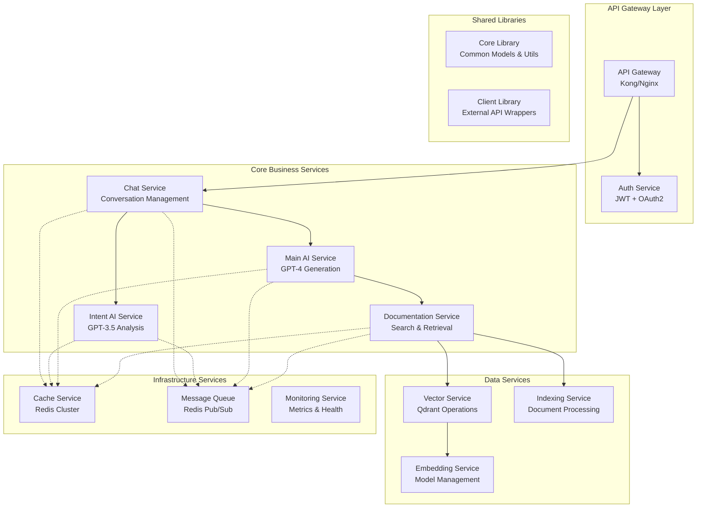

# Microservice Architecture Refactoring Plan

**Date**: 2025-01-28  
**Type**: Major Architecture Refactoring  
**Impact**: Enterprise Scalability & SOLID Compliance  

## Executive Summary

This plan addresses critical architectural issues preventing enterprise-scale deployment:
- **SOLID Principles Violations**: Tight coupling, interface segregation issues
- **Clustering Readiness**: Lack of message queues, shared state management
- **Build Inefficiency**: Dependencies rebuilt unnecessarily, no shared libraries
- **Database Context**: Improper DbContext implementation for microservices
- **Scalability Bottlenecks**: Monolithic design limiting horizontal scaling

## Current Architecture Analysis

### 🚨 Critical Issues Identified

#### 1. SOLID Principles Violations
```python
# Current Violation: AIService directly depends on concrete implementations
class AIService:
    def __init__(self, db: AsyncSession, doc_service: DocumentationService):
        self.documentation_service = doc_service  # Direct dependency
        self.client = AsyncOpenAI(api_key=settings.OPENAI_API_KEY)  # Tight coupling
```

#### 2. Clustering Limitations
- No message queues for inter-service communication
- Shared database sessions across services
- In-memory state management
- Direct service-to-service calls

#### 3. Build Inefficiency
```dockerfile
# Current: Dependencies rebuilt every time
COPY requirements.txt ./
RUN pip install -r requirements.txt  # 200MB+ rebuilt on every change
```

#### 4. Database Context Issues
```python
# Anti-pattern: Sharing database sessions
async def get_db() -> AsyncSession:
    async with async_session_factory() as session:  # Global session factory
```

## Proposed Microservice Architecture

### 🏗️ Service Decomposition



### 🎯 SOLID Principles Implementation

#### Single Responsibility Principle (SRP)
```python
# ✅ Each service has one responsibility
class ChatService:
    """Handles ONLY conversation management"""
    
class IntentAIService:
    """Handles ONLY intent analysis"""
    
class MainAIService:
    """Handles ONLY response generation"""
```

#### Open/Closed Principle (OCP)
```python
# ✅ Extensible through interfaces
from abc import ABC, abstractmethod

class AIProviderInterface(ABC):
    @abstractmethod
    async def generate_response(self, prompt: str) -> str:
        pass

class OpenAIProvider(AIProviderInterface):
    async def generate_response(self, prompt: str) -> str:
        # OpenAI implementation
        
class AnthropicProvider(AIProviderInterface):
    async def generate_response(self, prompt: str) -> str:
        # Anthropic implementation (future)
```

#### Liskov Substitution Principle (LSP)
```python
# ✅ Implementations are interchangeable
class DocumentationInterface(ABC):
    @abstractmethod
    async def search(self, query: str) -> List[Document]:
        pass

class AzureDevOpsProvider(DocumentationInterface):
    async def search(self, query: str) -> List[Document]:
        # Azure implementation
        
class ConfluenceProvider(DocumentationInterface):
    async def search(self, query: str) -> List[Document]:
        # Confluence implementation (future)
```

#### Interface Segregation Principle (ISP)
```python
# ✅ Focused interfaces
class SearchableInterface(ABC):
    @abstractmethod
    async def search(self, query: str) -> List[Document]:
        pass

class IndexableInterface(ABC):
    @abstractmethod
    async def index_document(self, doc: Document) -> bool:
        pass
        
class CacheableInterface(ABC):
    @abstractmethod
    async def get_cached(self, key: str) -> Optional[Any]:
        pass
```

#### Dependency Inversion Principle (DIP)
```python
# ✅ Depend on abstractions, not concretions
class AIService:
    def __init__(
        self,
        ai_provider: AIProviderInterface,
        cache: CacheableInterface,
        message_queue: MessageQueueInterface
    ):
        self.ai_provider = ai_provider
        self.cache = cache
        self.message_queue = message_queue
```

## Detailed Service Architecture

### 🚀 1. Shared Core Library

```
shared-core/
├── pyproject.toml
├── setup.py
├── flash_core/
│   ├── __init__.py
│   ├── models/
│   │   ├── base.py           # Base SQLAlchemy models
│   │   ├── conversation.py   # Shared conversation models
│   │   ├── document.py       # Document models
│   │   └── user.py          # User models
│   ├── interfaces/
│   │   ├── ai_provider.py    # AI provider interfaces
│   │   ├── cache.py         # Caching interfaces
│   │   ├── search.py        # Search interfaces
│   │   └── queue.py         # Message queue interfaces
│   ├── schemas/
│   │   ├── chat.py          # Pydantic models
│   │   ├── search.py        # Search schemas
│   │   └── auth.py          # Authentication schemas
│   ├── utils/
│   │   ├── logging.py       # Structured logging
│   │   ├── metrics.py       # Prometheus metrics
│   │   ├── validation.py    # Input validation
│   │   └── security.py      # Security utilities
│   └── config/
│       ├── base.py          # Base configuration
│       ├── database.py      # Database configuration
│       └── redis.py         # Redis configuration
```

### 🗣️ 2. Chat Service

```
services/chat-service/
├── Dockerfile
├── requirements.txt
├── app/
│   ├── main.py
│   ├── api/
│   │   ├── chat.py          # Chat endpoints
│   │   └── conversations.py # Conversation management
│   ├── services/
│   │   ├── chat_manager.py  # Core chat logic
│   │   ├── conversation.py  # Conversation persistence
│   │   └── session.py       # Session management
│   ├── database/
│   │   ├── connection.py    # Database connection pool
│   │   └── repositories/
│   │       ├── conversation_repo.py
│   │       └── message_repo.py
│   └── config.py
```

**Responsibilities:**
- Conversation lifecycle management
- Message routing to AI services
- Session state management
- WebSocket connections for streaming

**Database Context:**
```python
# ✅ Service-specific database context
class ChatDatabaseContext:
    def __init__(self):
        self.engine = create_async_engine(
            settings.CHAT_DATABASE_URI,
            pool_size=5,
            max_overflow=10
        )
        
    async def get_session(self) -> AsyncSession:
        async with async_sessionmaker(self.engine)() as session:
            yield session
```

### 🧠 3. AI Services (Intent & Main)

```
services/ai-intent-service/
├── Dockerfile
├── requirements.txt
├── app/
│   ├── main.py
│   ├── services/
│   │   ├── intent_analyzer.py    # GPT-3.5 intent analysis
│   │   ├── conversation_context.py # Context management
│   │   └── cache_manager.py      # Redis caching
│   └── providers/
│       └── openai_provider.py    # OpenAI client wrapper

services/ai-main-service/
├── Dockerfile
├── requirements.txt
├── app/
│   ├── main.py
│   ├── services/
│   │   ├── response_generator.py  # GPT-4 response generation
│   │   ├── context_builder.py     # Context assembly
│   │   └── quality_checker.py     # Response validation
│   └── providers/
│       └── openai_provider.py     # OpenAI client wrapper
```

### 📚 4. Documentation Service

```
services/documentation-service/
├── Dockerfile
├── requirements.txt
├── app/
│   ├── main.py
│   ├── api/
│   │   ├── search.py         # Search endpoints
│   │   └── management.py     # Admin endpoints
│   ├── services/
│   │   ├── search_service.py # Core search logic
│   │   ├── indexing_service.py # Document indexing
│   │   └── alias_service.py  # Semantic aliases
│   ├── providers/
│   │   ├── azure_devops.py   # Azure DevOps provider
│   │   ├── confluence.py     # Future: Confluence provider
│   │   └── notion.py         # Future: Notion provider
│   └── database/
│       └── repositories/
│           ├── document_repo.py
│           └── wiki_repo.py
```

### 🔍 5. Vector & Embedding Services

```
services/vector-service/
├── Dockerfile
├── requirements.txt
├── app/
│   ├── main.py
│   ├── services/
│   │   ├── vector_operations.py  # Qdrant operations
│   │   ├── collection_manager.py # Collection management
│   │   └── similarity_search.py  # Search algorithms
│   └── providers/
│       └── qdrant_provider.py    # Qdrant client wrapper

services/embedding-service/
├── Dockerfile
├── requirements.txt
├── app/
│   ├── main.py
│   ├── services/
│   │   ├── embedding_generator.py # Model inference
│   │   ├── model_manager.py       # Model lifecycle
│   │   └── batch_processor.py     # Batch processing
│   └── models/
│       └── sentence_transformers/ # Cached models
```

## Redis Integration Strategy

### 🔴 Redis Cluster Configuration

```yaml
# redis-cluster.yml
version: '3.8'
services:
  redis-master:
    image: redis:7-alpine
    command: redis-server --port 6379 --appendonly yes
    volumes:
      - redis_master_data:/data
    
  redis-replica-1:
    image: redis:7-alpine
    command: redis-server --port 6379 --appendonly yes --replicaof redis-master 6379
    depends_on:
      - redis-master
    
  redis-sentinel:
    image: redis:7-alpine
    command: redis-sentinel /etc/redis/sentinel.conf
    volumes:
      - ./redis/sentinel.conf:/etc/redis/sentinel.conf
```

### 🎯 Redis Usage Patterns

#### 1. Caching Layer
```python
# flash_core/services/cache.py
class RedisCacheService:
    def __init__(self):
        self.redis = redis.Redis(
            host=settings.REDIS_HOST,
            port=settings.REDIS_PORT,
            decode_responses=True
        )
    
    async def get_conversation_cache(self, conversation_id: str) -> Optional[Dict]:
        """Cache conversation context for 30 minutes"""
        return await self.redis.get(f"conv:{conversation_id}")
    
    async def cache_search_results(self, query_hash: str, results: List[Dict]):
        """Cache search results for 1 hour"""
        await self.redis.setex(f"search:{query_hash}", 3600, json.dumps(results))
    
    async def cache_embedding(self, text_hash: str, embedding: List[float]):
        """Cache embeddings for 24 hours"""
        await self.redis.setex(f"embed:{text_hash}", 86400, json.dumps(embedding))
```

#### 2. Message Queue (Pub/Sub)
```python
# flash_core/services/message_queue.py
class RedisMessageQueue:
    def __init__(self):
        self.redis = redis.Redis(host=settings.REDIS_HOST, port=settings.REDIS_PORT)
    
    async def publish_ai_request(self, request: AIRequest):
        """Publish AI processing request"""
        await self.redis.publish("ai_requests", request.json())
    
    async def publish_indexing_job(self, job: IndexingJob):
        """Publish document indexing job"""
        await self.redis.publish("indexing_jobs", job.json())
    
    async def subscribe_to_responses(self, callback):
        """Subscribe to AI responses"""
        pubsub = self.redis.pubsub()
        await pubsub.subscribe("ai_responses")
        async for message in pubsub.listen():
            await callback(message)
```

#### 3. Session Management
```python
# services/chat-service/app/services/session.py
class SessionManager:
    def __init__(self, redis_client):
        self.redis = redis_client
    
    async def create_session(self, user_id: int, conversation_id: str):
        """Create user session with 24-hour TTL"""
        session_data = {
            "user_id": user_id,
            "conversation_id": conversation_id,
            "created_at": datetime.utcnow().isoformat(),
            "mode": "company"
        }
        await self.redis.setex(f"session:{conversation_id}", 86400, json.dumps(session_data))
    
    async def get_active_sessions(self, user_id: int) -> List[str]:
        """Get all active sessions for user"""
        pattern = f"session:*"
        sessions = []
        async for key in self.redis.scan_iter(match=pattern):
            session_data = await self.redis.get(key)
            if session_data and json.loads(session_data)["user_id"] == user_id:
                sessions.append(key.split(":")[1])
        return sessions
```

#### 4. Rate Limiting
```python
# flash_core/middleware/rate_limit.py
class RedisRateLimiter:
    def __init__(self, redis_client):
        self.redis = redis_client
    
    async def check_rate_limit(self, user_id: int, limit: int = 100, window: int = 3600) -> bool:
        """Check if user is within rate limit (100 requests/hour)"""
        key = f"rate_limit:{user_id}:{datetime.utcnow().hour}"
        current = await self.redis.incr(key)
        if current == 1:
            await self.redis.expire(key, window)
        return current <= limit
```

## Database Context Refactoring

### 🗃️ Service-Specific Database Contexts

```python
# flash_core/database/base.py
class ServiceDatabaseContext:
    def __init__(self, service_name: str, database_uri: str):
        self.service_name = service_name
        self.engine = create_async_engine(
            database_uri,
            pool_size=settings.DB_POOL_SIZE,
            max_overflow=settings.DB_MAX_OVERFLOW,
            pool_pre_ping=True,
            pool_recycle=3600
        )
        self.session_factory = async_sessionmaker(
            self.engine,
            class_=AsyncSession,
            expire_on_commit=False
        )
    
    async def get_session(self) -> AsyncSession:
        """Get database session with proper error handling"""
        async with self.session_factory() as session:
            try:
                yield session
                await session.commit()
            except Exception:
                await session.rollback()
                raise
            finally:
                await session.close()
    
    async def health_check(self) -> bool:
        """Check database connectivity"""
        try:
            async with self.session_factory() as session:
                await session.execute(text("SELECT 1"))
                return True
        except Exception:
            return False

# services/chat-service/app/database/context.py
class ChatDatabaseContext(ServiceDatabaseContext):
    def __init__(self):
        super().__init__(
            service_name="chat",
            database_uri=settings.CHAT_DATABASE_URI
        )

# services/documentation-service/app/database/context.py
class DocumentationDatabaseContext(ServiceDatabaseContext):
    def __init__(self):
        super().__init__(
            service_name="documentation", 
            database_uri=settings.DOCS_DATABASE_URI
        )
```

## Docker Optimization Strategy

### 🐳 Multi-Stage Builds with Shared Base

```dockerfile
# shared-base.Dockerfile
FROM python:3.9-slim as python-base
ENV PYTHONUNBUFFERED=1 \
    PYTHONDONTWRITEBYTECODE=1 \
    PIP_NO_CACHE_DIR=1 \
    PIP_DISABLE_PIP_VERSION_CHECK=1

# Build stage for shared dependencies
FROM python-base as shared-deps
WORKDIR /app
COPY shared-core/requirements.txt ./
RUN pip install --no-cache-dir -r requirements.txt

# Final shared base image
FROM python-base as shared-base
COPY --from=shared-deps /usr/local/lib/python3.9/site-packages/ /usr/local/lib/python3.9/site-packages/
COPY --from=shared-deps /usr/local/bin/ /usr/local/bin/
```

```dockerfile
# services/chat-service/Dockerfile
FROM shared-base as service-deps
WORKDIR /app
COPY requirements.txt ./
RUN pip install --no-cache-dir -r requirements.txt

FROM shared-base
COPY --from=service-deps /usr/local/lib/python3.9/site-packages/ /usr/local/lib/python3.9/site-packages/
COPY --from=service-deps /usr/local/bin/ /usr/local/bin/
COPY . .
EXPOSE 8000
CMD ["uvicorn", "app.main:app", "--host", "0.0.0.0", "--port", "8000"]
```

### 📦 Dependency Optimization

```
# shared-core/requirements.txt (Core dependencies)
fastapi==0.110.0
pydantic==2.6.3
sqlalchemy==2.0.28
redis==5.0.1
prometheus-client==0.19.0

# services/chat-service/requirements.txt (Service-specific)
websockets==12.0
python-socketio==5.10.0

# services/ai-intent-service/requirements.txt
openai==1.3.5
tiktoken==0.5.2

# services/vector-service/requirements.txt  
qdrant-client==1.7.3
numpy==1.24.3
```

## Message Queue Architecture

### 🚀 Redis Pub/Sub Patterns

```python
# flash_core/messaging/events.py
from enum import Enum
from pydantic import BaseModel

class EventType(str, Enum):
    AI_REQUEST = "ai_request"
    AI_RESPONSE = "ai_response"
    INDEXING_JOB = "indexing_job"
    CACHE_INVALIDATION = "cache_invalidation"

class AIRequestEvent(BaseModel):
    event_type: EventType = EventType.AI_REQUEST
    conversation_id: str
    query: str
    mode: str
    user_id: int
    timestamp: datetime

class AIResponseEvent(BaseModel):
    event_type: EventType = EventType.AI_RESPONSE
    conversation_id: str
    response: str
    sources: List[Dict]
    confidence: float
    timestamp: datetime
```

```python
# services/chat-service/app/services/event_handler.py
class ChatEventHandler:
    def __init__(self, message_queue: RedisMessageQueue):
        self.message_queue = message_queue
    
    async def handle_chat_request(self, request: ChatRequest):
        """Handle incoming chat request"""
        # Publish to intent AI service
        intent_event = AIRequestEvent(
            conversation_id=request.conversation_id,
            query=request.query,
            mode="intent_analysis",
            user_id=request.user_id
        )
        await self.message_queue.publish("ai_intent_queue", intent_event)
    
    async def handle_ai_response(self, response: AIResponseEvent):
        """Handle AI response and send to client"""
        # Update conversation
        await self.conversation_service.add_message(
            response.conversation_id,
            role="assistant",
            content=response.response
        )
        
        # Send to WebSocket client
        await self.websocket_manager.send_response(
            response.conversation_id,
            response
        )
```

## Implementation Phases

### 📅 Phase 1: Foundation (Weeks 1-2)
1. **Create Shared Core Library**
   - Define interfaces and base models
   - Implement Redis services
   - Set up logging and metrics
   - Create base Docker images

2. **Database Context Refactoring**
   - Implement service-specific contexts
   - Update connection pooling
   - Add health checks

### 📅 Phase 2: Service Extraction (Weeks 3-4)
1. **Extract Chat Service**
   - Move conversation management
   - Implement WebSocket handling
   - Add session management

2. **Extract AI Services**
   - Separate intent and main AI services
   - Implement message queue communication
   - Add caching layer

### 📅 Phase 3: Data Services (Weeks 5-6)
1. **Extract Documentation Service**
   - Move search and indexing logic
   - Implement provider pattern
   - Add Redis caching

2. **Extract Vector & Embedding Services**
   - Separate Qdrant operations
   - Create embedding service
   - Implement model management

### 📅 Phase 4: Infrastructure (Weeks 7-8)
1. **Redis Cluster Setup**
   - Configure Redis Sentinel
   - Implement pub/sub messaging
   - Add distributed caching

2. **API Gateway & Monitoring**
   - Set up Kong/Nginx gateway
   - Implement service discovery
   - Add comprehensive monitoring

### 📅 Phase 5: Optimization (Weeks 9-10)
1. **Performance Tuning**
   - Optimize database queries
   - Fine-tune cache strategies
   - Load testing and optimization

2. **Production Deployment**
   - Kubernetes manifests
   - CI/CD pipeline updates
   - Documentation and training

## Success Metrics

### 🎯 Performance Targets
- **Response Time**: < 500ms for cached requests
- **Throughput**: 1000+ concurrent users
- **Availability**: 99.9% uptime
- **Scalability**: Horizontal scaling capability

### 📊 Code Quality Metrics
- **SOLID Compliance**: 100% interface-based dependencies
- **Test Coverage**: > 90% for all services
- **Code Duplication**: < 3%
- **Cyclomatic Complexity**: < 10 per method

## Risk Mitigation

### ⚠️ Identified Risks
1. **Data Consistency**: Distributed transactions complexity
2. **Network Latency**: Inter-service communication overhead
3. **Operational Complexity**: Multiple services to manage
4. **Migration Complexity**: Existing data migration

### 🛡️ Mitigation Strategies
1. **Event Sourcing**: Implement event-driven consistency
2. **Circuit Breakers**: Prevent cascade failures
3. **Gradual Migration**: Strangler Fig pattern
4. **Comprehensive Testing**: End-to-end test suites

## Next Steps

1. **Review and Approve** this architectural plan
2. **Set up Development Environment** with Redis cluster
3. **Create Shared Core Library** foundation
4. **Begin Phase 1 Implementation** with database context refactoring

This refactoring will transform AskFlash into a truly scalable, enterprise-ready microservice architecture that follows SOLID principles, supports clustering, and optimizes build efficiency while maintaining the high-quality user experience Flash Group expects. 