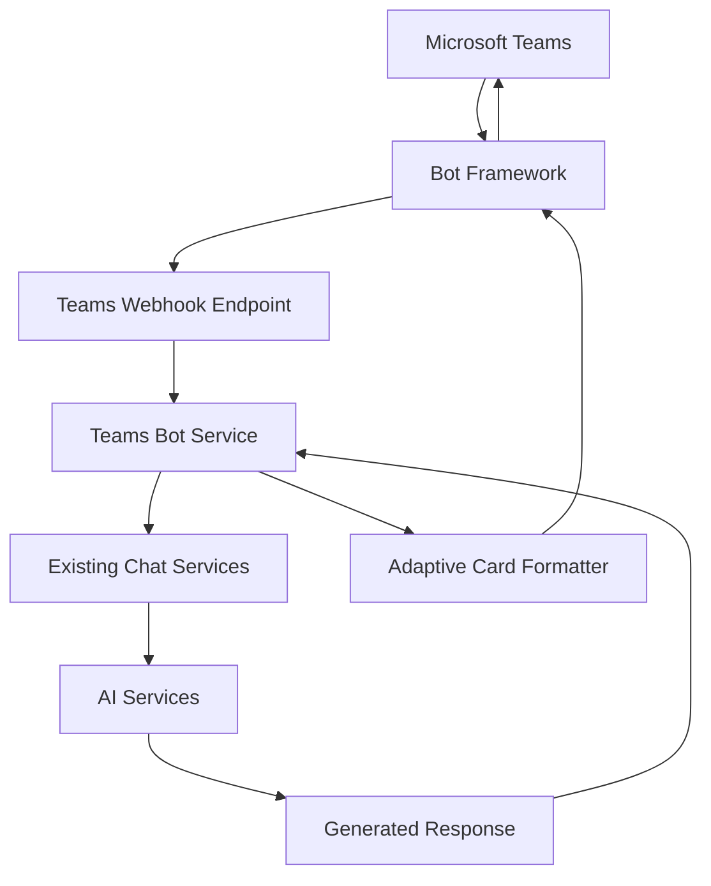

# Microsoft Teams Integration Plan for Flash AI Assistant

**Created**: 2025-01-28  
**Status**: Planning Phase  
**Priority**: High - Internal Enterprise Adoption  

## Overview

Integrate Microsoft Teams with Flash AI Assistant to enable employees to access the company AI chat directly through Teams conversations, improving adoption and accessibility within the existing corporate workflow.

## Integration Architecture

### Option 1: Microsoft Bot Framework (Recommended)
- **Pros**: Enterprise-grade, rich features, supports all Teams functionality
- **Cons**: More complex setup, requires Azure Bot Service registration
- **Best for**: Full-featured enterprise deployment

### Option 2: Incoming Webhooks (Simple Alternative)
- **Pros**: Simple setup, lightweight
- **Cons**: One-way communication only, limited features
- **Best for**: Notifications and simple integrations

**Recommendation**: Start with Bot Framework for full bidirectional chat capability.

## Technical Implementation Plan

### Phase 1: Bot Framework Integration

#### 1.1 Dependencies & Setup
```bash
# Add to backend/requirements.txt
botbuilder-core==4.16.1
botframework-connector==4.16.1
botframework-streaming==4.16.1
aiohttp==3.10.5  # For Bot Framework compatibility
```

#### 1.2 Teams Bot Service Structure
```python
# New service: app/services/teams_bot.py
class FlashTeamsBotService:
    """Microsoft Teams Bot integration service"""
    
    async def handle_teams_message(self, activity: Activity) -> str:
        """Process Teams message using existing chat services"""
        
    async def send_teams_response(self, context: TurnContext, response: str):
        """Send response back to Teams with Flash branding"""
```

#### 1.3 Bot Endpoint Integration
```python
# New endpoint: app/api/api_v1/endpoints/teams.py
@router.post("/teams/messages")
async def teams_webhook(request: Request):
    """Handle incoming Teams messages via Bot Framework"""
```

### Phase 2: Teams-Specific Features

#### 2.1 Adaptive Cards Support
- Rich message formatting for better UX in Teams
- Source citations as clickable cards
- Mode indicators (Flash Team vs General)

#### 2.2 Teams Context Integration
- Channel-specific conversations
- @mention handling for Flash AI
- Team member context and permissions

#### 2.3 Authentication & Security
- Azure AD integration for user identification
- Teams-specific security validation
- Rate limiting per user/channel

## Implementation Steps

### Step 1: Core Bot Framework Integration

1. **Create Teams Bot Service**
   - Implement `FlashTeamsBotService` class
   - Integrate with existing AI services
   - Handle Teams-specific message formatting

2. **Add Teams Webhook Endpoint**
   - Create `/api/v1/teams/messages` endpoint
   - Implement Bot Framework message processing
   - Route to existing chat services

3. **Bot Registration & Configuration**
   - Register bot in Azure Bot Service or Teams Developer Portal
   - Configure webhook URL pointing to our API
   - Set up authentication credentials

### Step 2: Enhanced Teams Features

1. **Adaptive Cards Implementation**
   - Design Flash-branded card templates
   - Implement rich response formatting
   - Add interactive elements (buttons, actions)

2. **Teams Context Integration**
   - Handle @mentions of the bot
   - Support channel vs private message contexts
   - Implement conversation threading

3. **Enterprise Features**
   - Azure AD authentication integration
   - User permission management
   - Audit logging for Teams interactions

## Technical Architecture

### Message Flow


### Database Schema Extensions
```sql
-- Extend existing conversation tracking for Teams
ALTER TABLE conversations ADD COLUMN teams_conversation_id VARCHAR(255);
ALTER TABLE conversations ADD COLUMN teams_channel_id VARCHAR(255);
ALTER TABLE conversations ADD COLUMN teams_user_id VARCHAR(255);

-- New table for Teams-specific metadata
CREATE TABLE teams_interactions (
    id UUID PRIMARY KEY DEFAULT gen_random_uuid(),
    conversation_id UUID REFERENCES conversations(id),
    teams_activity_id VARCHAR(255),
    teams_service_url VARCHAR(500),
    channel_type VARCHAR(50), -- 'channel', 'groupChat', 'personal'
    created_at TIMESTAMP DEFAULT NOW()
);
```

## Configuration Requirements

### Environment Variables
```bash
# Teams Bot Configuration
TEAMS_APP_ID=your-teams-app-id
TEAMS_APP_PASSWORD=your-teams-app-password
TEAMS_WEBHOOK_URL=https://your-domain.com/api/v1/teams/messages

# Azure AD Integration (Optional)
AZURE_TENANT_ID=your-tenant-id
AZURE_CLIENT_ID=your-client-id
AZURE_CLIENT_SECRET=your-client-secret
```

### Teams App Manifest
```json
{
  "name": {
    "short": "Flash AI Assistant",
    "full": "Flash AI Assistant - Making Life Easier"
  },
  "description": {
    "short": "AI-powered assistant for Flash Group employees",
    "full": "Enterprise AI assistant with company-specific knowledge and general AI capabilities"
  },
  "icons": {
    "outline": "outline.png",
    "color": "color.png"
  },
  "bots": [
    {
      "botId": "your-bot-id",
      "scopes": ["personal", "team", "groupchat"],
      "supportsFiles": false,
      "isNotificationOnly": false
    }
  ]
}
```

## User Experience Design

### Teams Chat Interface
1. **Bot Responses**: Flash-branded Adaptive Cards with:
   - Flash green (#7ed321) accent colors
   - Cow emoji (🐄) branding
   - Mode indicators (Flash Team/General)
   - Source citations as clickable elements

2. **Commands**: Support for slash commands:
   - `/flash help` - Show available commands
   - `/flash company [query]` - Force company mode
   - `/flash general [query]` - Force general mode
   - `/flash new` - Start new conversation

3. **@Mentions**: Respond to `@Flash AI` mentions in channels

## Testing Strategy

### Development Testing
1. **Bot Framework Emulator**: Local testing with emulator
2. **Test Teams Environment**: Dedicated Teams workspace for testing
3. **Unit Tests**: Comprehensive testing of Teams service integration

### Production Validation
1. **Phased Rollout**: Start with specific teams/channels
2. **Monitoring**: Track usage, performance, and user satisfaction
3. **Feedback Collection**: Gather user feedback for improvements

## Deployment Considerations

### Infrastructure
- Ensure FastAPI backend can handle Teams webhook load
- Configure proper HTTPS endpoints for Teams webhook
- Set up monitoring for Teams-specific metrics

### Security
- Validate all incoming Teams requests
- Implement proper authentication flow
- Ensure data privacy compliance for Teams interactions

## Success Metrics

### Technical Metrics
- Response time for Teams messages
- Message processing success rate
- Uptime and availability

### Business Metrics
- Teams adoption rate vs web interface
- User engagement and satisfaction
- Reduction in support tickets

## Timeline

### Week 1-2: Foundation
- Implement core Bot Framework integration
- Create Teams webhook endpoint
- Basic message processing

### Week 3-4: Enhancement
- Add Adaptive Cards support
- Implement Teams-specific features
- User authentication integration

### Week 5-6: Testing & Deployment
- Comprehensive testing
- Production deployment
- User training and rollout

## Maintenance Plan

### Ongoing Tasks
- Monitor Teams API changes and deprecations
- Update Bot Framework dependencies
- Gather user feedback and iterate

### Future Enhancements
- Voice message support
- File sharing capabilities
- Advanced Teams integration features
- Custom Teams app extensions

---

This integration will significantly improve Flash AI Assistant adoption by meeting users where they already work, providing seamless access to both company-specific and general AI assistance directly within Microsoft Teams. 