# Flash AI Assistant - Technical Architecture Overview

**Document Type**: Technical Architecture Brief  
**Audience**: Technical Leadership & Steering Committee  
**Date**: 2025-06-20  
**Status**: Production Implementation

## System Architecture Summary

Flash AI Assistant is built on a **modern, enterprise-grade architecture** using industry-standard technologies and best practices. The system is designed for scalability, security, and seamless integration with Flash Group's existing infrastructure.

### High-Level Architecture

```mermaid
graph TB
    subgraph "User Interfaces"
        WEB[🌐 Flash AI Web App<br/>React + Modern UI]
        TEAMS[👥 Microsoft Teams Bot<br/>Bot Framework Integration]
    end
    
    subgraph "API Gateway Layer"
        API[⚡ FastAPI Backend<br/>Python + JWT Auth]
        STREAM[📡 Real-time Streaming<br/>WebSocket Support]
    end
    
    subgraph "AI Processing Engine"
        RAG[🧠 RAG Engine<br/>Retrieval-Augmented Generation]
        QUALITY[✅ Information Quality Analyzer<br/>Conflict Detection + Authority Scoring]
        INTENT[🎯 Intent Classification<br/>Company vs General Mode Detection]
    end
    
    subgraph "Integration Layer"
        INTMGR[🔧 Integration Manager<br/>Flexible Multi-Source Support]
        AZDO[📚 Azure DevOps Wikis<br/>Flash Documentation]
        FUTURE[🔮 Future Integrations<br/>Notion, GitHub, SharePoint]
    end
    
    subgraph "Data Layer"
        VDB[(🔍 Qdrant Vector Database<br/>Semantic Search)]
        PG[(📊 PostgreSQL<br/>Configuration + History)]
        EMBED[🔢 OpenAI Embeddings<br/>Text Vectorization]
    end
    
    WEB --> API
    TEAMS --> API
    API --> STREAM
    API --> RAG
    RAG --> QUALITY
    RAG --> INTENT
    RAG --> INTMGR
    INTMGR --> AZDO
    INTMGR --> FUTURE
    RAG --> VDB
    RAG --> PG
    VDB --> EMBED
```

## Key Technical Components

### 1. **Intelligent Integration System** 🔧

**Business Value**: Flexible, multi-source documentation access  
**Technical Implementation**: 
- Dynamic integration management through database configuration
- Support for multiple Azure DevOps instances, future expansion to Notion/GitHub
- Environment-based security for sensitive authentication tokens
- Priority-based source ranking and failover

**Flash Group Benefit**: Easy addition of new documentation sources without code changes

### 2. **Advanced RAG (Retrieval-Augmented Generation)** 🧠

**Business Value**: Accurate, contextual responses from Flash-specific content  
**Technical Implementation**:
- Semantic search using 384-dimensional vector embeddings
- Intelligent text chunking preserving document structure
- Cross-reference validation between multiple sources
- Real-time quality scoring and conflict detection

**Flash Group Benefit**: Reliable, accurate answers specific to Flash processes and teams

### 3. **Microsoft Teams Integration** 👥

**Business Value**: Zero-friction adoption within existing workflow  
**Technical Implementation**:
- Microsoft Bot Framework with adaptive cards
- Rich messaging with Flash branding (#7ed321 colors, 🐄 emoji)
- Command support (`/flash company`, `/flash general`)
- Enterprise authentication and security compliance

**Flash Group Benefit**: No new tools to learn - works where teams already collaborate

### 4. **Information Quality Enhancement** ✅

**Business Value**: Identifies outdated or conflicting documentation  
**Technical Implementation**:
- Real-time conflict detection across sources
- Authority-based scoring (Azure DevOps > Confluence > SharePoint)
- Freshness analysis with time-based decay
- Missing information gap identification

**Flash Group Benefit**: Proactively improves documentation quality and completeness

## Technical Excellence Standards

### Security & Compliance ✅

| Security Layer | Implementation | Flash Group Benefit |
|---------------|---------------|-------------------|
| **Authentication** | JWT tokens + Azure AD integration | Single sign-on with existing credentials |
| **Data Sovereignty** | Private deployment, no external data sharing | Full control over sensitive information |
| **API Security** | Rate limiting, CORS configuration | Protection against abuse and unauthorized access |
| **Environment Security** | Sensitive tokens in environment variables | Separation of secrets from code |

### Scalability & Performance ⚡

| Component | Scaling Strategy | Current Capacity |
|-----------|-----------------|------------------|
| **API Layer** | Horizontal scaling with Docker containers | 100+ concurrent users |
| **Vector Database** | Qdrant cluster support | 1M+ document embeddings |
| **Background Processing** | Async task queue for embeddings | Real-time + batch processing |
| **Caching** | Response caching for frequently asked questions | Sub-second response times |

### Monitoring & Observability 📊

- **Application Logging**: Structured logging with correlation IDs
- **Performance Metrics**: Response times, token usage, user interactions
- **Health Monitoring**: Endpoint availability and dependency health checks
- **Usage Analytics**: User adoption patterns and feature utilization

## Integration Architecture

### Current Integrations ✅

1. **Azure DevOps Wikis**
   - Flash SRE-DevOPS documentation
   - Team structure and contact information
   - Standard operating procedures and runbooks
   - Technical documentation and guides

2. **OpenAI GPT-4**
   - Primary language model for response generation
   - Embeddings generation for semantic search
   - Streaming response support for real-time interaction

3. **Microsoft Teams**
   - Bot Framework integration
   - Adaptive card messaging
   - Channel and direct message support

### Planned Integrations 🚀

1. **Notion Databases** - Knowledge base expansion
2. **GitHub Repositories** - Technical documentation and wikis  
3. **SharePoint Sites** - Business process documentation
4. **Dynatrace Logs** - Operational insights and troubleshooting

## Deployment Architecture

### Current Environment

- **Platform**: Docker containers on Azure/local infrastructure
- **Database**: PostgreSQL for configuration, Qdrant for vector search
- **API**: FastAPI with async processing and WebSocket support
- **Frontend**: React.js with modern responsive design

### Production Readiness ✅

| Requirement | Status | Implementation |
|------------|--------|---------------|
| **High Availability** | ✅ Ready | Container orchestration, database clustering |
| **Backup & Recovery** | ✅ Ready | Database backups, configuration versioning |
| **Monitoring** | ✅ Ready | Health endpoints, logging, metrics collection |
| **Security** | ✅ Ready | Authentication, authorization, secure communications |

## Technical Risks & Mitigation

### Low-Risk Technology Choices ✅

| Risk | Probability | Impact | Mitigation |
|------|------------|--------|------------|
| **OpenAI API Changes** | Low | Medium | Abstracted AI service layer, alternative model support |
| **Scaling Bottlenecks** | Low | Low | Horizontal scaling design, performance monitoring |
| **Integration Failures** | Low | Low | Fallback mechanisms, graceful degradation |
| **Security Vulnerabilities** | Low | Medium | Regular security updates, penetration testing |

## Future Technical Roadmap

### Phase 1: Current Capabilities ✅ **COMPLETE**
- Flash AI web interface with company/general modes
- Microsoft Teams bot integration
- Azure DevOps wiki search and retrieval
- Real-time streaming responses

### Phase 2: Enhanced Intelligence 🚀 **6 MONTHS**
- Multi-modal support (images, documents, code)
- Advanced workflow automation
- Predictive analytics and insights
- Custom model fine-tuning on Flash data

### Phase 3: Enterprise Platform 🌟 **12 MONTHS**
- API marketplace for Flash systems integration
- Advanced analytics and reporting dashboard
- Multi-tenant support for different business units
- AI-powered business process automation

---

**Technical Recommendation**: The architecture is **production-ready and enterprise-grade**. The system demonstrates Flash Group's technical sophistication and positions us as an AI-forward organization ready for future innovation. 