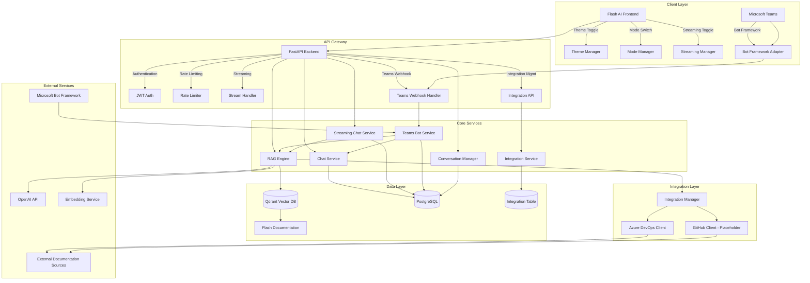
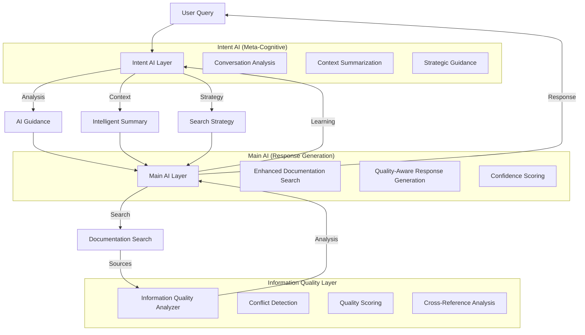

# Flash AI Assistant - Technical Architecture

**Version**: 2025-06-10  
**Status**: Production Ready with Legacy (NL) Mode as Primary

## System Overview

Flash AI Assistant is an enterprise-grade RAG (Retrieval-Augmented Generation) system specifically designed for Flash Group's digital ecosystem. The application combines company-specific knowledge retrieval with general AI capabilities, accessible through both web and Microsoft Teams interfaces. The system uses a **legacy natural language (NL) mode as the primary mode**, with enhanced features for company-specific queries.

### Core Value Proposition

- **Flash-Branded Experience**: Custom UI reflecting Flash Group's "making life easier" philosophy
- **Dual Intelligence Modes**: Company-specific (Flash Team) and general AI assistance
- **Enhanced Streaming Chat**: Real-time AI reasoning with step-by-step thinking display
- **Multi-Platform Access**: Web interface and Microsoft Teams integration
- **Modern UX**: Dark/light mode support with responsive design
- **Enterprise Ready**: Scalable architecture with proper security and monitoring

## System Architecture

**Integration System Status**: ✅ Fully Operational (Fixed 2025-06-18)  
All services now properly use the flexible Integration table instead of rigid configuration fields.



## Microsoft Teams Integration Architecture

### Teams Bot Framework Integration

Flash AI Assistant integrates with Microsoft Teams through the Bot Framework, providing enterprise employees seamless access to AI assistance within their existing workflow.

```mermaid
graph TB
    subgraph "Microsoft Teams"
        USER[Team Member]
        CHANNEL[Teams Channel]
        CHAT[Direct Message]
        MENTION[@Flash AI Mention]
    end
    
    subgraph "Bot Framework"
        ACTIVITY[Activity Handler]
        ADAPTER[Bot Framework Adapter]
        AUTH[Authentication]
    end
    
    subgraph "Flash AI Backend"
        WEBHOOK[Teams Webhook Endpoint]
        TEAMSVC[Teams Bot Service]
        AISVC[AI Services]
        CARDS[Adaptive Cards Builder]
    end
    
    USER --> CHANNEL
    USER --> CHAT
    USER --> MENTION
    CHANNEL --> ACTIVITY
    CHAT --> ACTIVITY
    MENTION --> ACTIVITY
    ACTIVITY --> ADAPTER
    ADAPTER --> AUTH
    AUTH --> WEBHOOK
    WEBHOOK --> TEAMSVC
    TEAMSVC --> AISVC
    AISVC --> CARDS
    CARDS --> ADAPTER
    ADAPTER --> USER
```

### Teams-Specific Features

1. **Rich Messaging**: Adaptive Cards with Flash branding and interactive elements
2. **Command Support**: Slash commands (`/flash company`, `/flash general`, `/flash help`)
3. **Context Awareness**: Channel vs direct message context handling
4. **Enterprise Security**: Bot Framework authentication and validation
5. **Flash Branding**: Consistent 🐄 emoji and #7ed321 color scheme

### Teams API Endpoints

- `POST /api/v1/teams/messages` - Main webhook for Teams messages
- `GET /api/v1/teams/health` - Health check for Teams integration
- `GET /api/v1/teams/config` - Configuration information
- `POST /api/v1/teams/test` - Development testing endpoint
- `GET /api/v1/teams/manifest` - Teams app manifest generation

## Information Quality Enhancement System

### NEW: Information Quality Analyzer

The system now includes a sophisticated Information Quality Enhancement layer that addresses "fire and forget" documentation problems through real-time conflict detection and quality scoring.

```python
# services/information_quality_analyzer.py - Core Features
class InformationQualityAnalyzer:
    """
    Addresses documentation quality issues with:
    - Conflict detection between sources
    - Authority scoring (Azure DevOps: 0.9, Confluence: 0.8, etc.)
    - Freshness scoring (time-based decay)
    - Cross-reference validation
    - Missing information identification
    """
```

#### Quality Analysis Components

- **Conflict Detection**: Identifies contradictory or missing information across sources
- **Authority Scoring**: Source reliability based on platform (Azure DevOps > Confluence > SharePoint)
- **Freshness Scoring**: Time-based decay (30 days=100%, 90 days=80%, etc.)
- **Cross-Reference Validation**: Corroboration between multiple sources
- **Missing Information Detection**: Identifies gaps in documentation coverage

#### Real-Time Quality Feedback

Users receive real-time information quality analysis:
- "Analyzing information quality and detecting conflicts..."
- "✅ High quality sources detected (average: 89%)"
- "⚠️ Detected 1 information conflicts"
- "Missing team members in some sources: John Doe, Jane Smith"
- "Cross-referencing information across 5 sources"

#### Enhanced AI Context

The AI receives enhanced system prompts with quality analysis:
```
INFORMATION QUALITY ANALYSIS:
- Sources analyzed: 3
- Information conflicts detected: 1  
- Overall confidence: 65%

DETECTED CONFLICTS - HANDLE WITH CARE:
- Team membership conflict detected between sources
- Some sources may have incomplete or outdated team information

CONFLICT RESOLUTION GUIDANCE:
- Acknowledge when sources provide conflicting information
- Use phrases like "According to [source], though other sources may have additional members..."
- Recommend verifying current information through official channels
```

## Dual-AI Architecture with Information Quality Enhancement

### Architecture Overview

The system implements a sophisticated dual-AI architecture with information quality analysis inspired by Cursor IDE's "Thought" layer:



### AI Processing Pipeline

1. **Intent AI Layer** (GPT-3.5-turbo)
   - Fast conversation analysis for cost efficiency
   - Intent detection and conversation type classification
   - Intelligent context summarization
   - Strategic guidance generation for Main AI

2. **Information Quality Analyzer** (New)
   - Addresses "fire and forget" documentation problems
   - Detects conflicts between information sources
   - Scores source authority, freshness, and completeness
   - Provides cross-reference validation

3. **Main AI Layer** (GPT-4)
   - Documentation search and retrieval
   - Quality-enhanced response generation with conflict awareness
   - Quality assessment and confidence scoring
   - Source citation and conflict acknowledgment

### Information Quality Enhancement Features

#### **Quality Analysis Components**
- **Conflict Detection**: Identifies missing, contradictory, or outdated information
- **Authority Scoring**: Azure DevOps (0.9) > Confluence (0.8) > SharePoint (0.7) > GitHub (0.6)
- **Freshness Scoring**: Time-based decay (30 days=100%, 90 days=80%, etc.)
- **Cross-Reference Validation**: Corroboration between multiple sources

#### **Real-Time User Feedback**
- "Analyzing information quality and detecting conflicts..."
- "✅ High quality sources detected (average: 89%)"
- "⚠️ Detected 1 information conflicts"
- "Missing team members in some sources: John Doe, Jane Smith"
- "Cross-referencing information across 5 sources"

#### **Quality-Aware AI Responses**
The AI now receives enhanced system prompts with quality context:
```
INFORMATION QUALITY ANALYSIS:
- Sources analyzed: 3
- Information conflicts detected: 1
- Overall confidence: 65%

DETECTED CONFLICTS - HANDLE WITH CARE:
- Team membership conflict detected between sources
- Some sources may have incomplete or outdated team information

CONFLICT RESOLUTION GUIDANCE:
- Acknowledge when sources provide conflicting information
- Use phrases like "According to [source], though other sources may have additional members..."
- Recommend verifying current information through official channels
```

## Frontend Architecture

### React Component Hierarchy

```
Flash AI Assistant
├── App.js (Root)
└── Chat.js (Main Interface)
    ├── Header
    │   ├── Brand Logo (🐄 Flash AI)
    │   ├── Mode Indicator
    │   │   ├── Mode Badge (Flash Team/General)
    │   │   └── Streaming Badge (🧠 Enhanced)
    │   └── Controls
    │       ├── Streaming Toggle (🧠/⚡)
    │       ├── Theme Toggle (🌙/☀️)
    │       ├── Mode Toggle (🐄/🌐)
    │       └── New Chat Button
    ├── Messages Container
    │   ├── Welcome Message (Flash-branded)
    │   ├── Message Components
    │   │   ├── User Messages
    │   │   └── Assistant Messages
    │   │       ├── Markdown Content
    │   │       ├── Source Citations
    │   │       └── Confidence Indicators
    │   ├── Thinking Indicator
    │   │   ├── Thinking Header (🧠 Flash AI is thinking...)
    │   │   └── Thinking Steps (Real-time updates)
    │   └── Typing Indicator (Regular mode)
    └── Input Container
        ├── Auto-resizing Textarea
        ├── Send Button
        └── Enhanced Mode Indicators
```

### State Management Architecture

```javascript
// Application State Structure
const ChatState = {
  // UI State
  darkMode: boolean,           // Theme preference
  mode: 'company' | 'general', // Chat mode
  useStreaming: boolean,       // Enhanced reasoning toggle
  loading: boolean,            // Request state
  error: string,               // Error messages
  
  // Chat State
  messages: Message[],         // Conversation history
  query: string,               // Current input
  conversationId: string,      // Session identifier
  
  // Streaming State
  isThinking: boolean,         // AI reasoning indicator
  thinkingSteps: ThinkingStep[], // Real-time thinking steps
  
  // Persistence
  localStorage: {
    'flash-theme': 'light' | 'dark',
    'flash-streaming': 'true' | 'false'
  }
};
```

### Theme System Architecture

The application implements a comprehensive theme system using CSS custom properties:

```css
/* Light Theme (Default) */
:root {
  /* Flash Brand Colors */
  --flash-primary: #7ed321;     /* Flash Green */
  --flash-secondary: #3498db;   /* Flash Blue */
  --flash-accent: #f39c12;      /* Flash Orange */
  --flash-success: #27ae60;     /* Flash Green */
  
  /* Semantic Colors */
  --bg-primary: #ffffff;
  --text-primary: #202123;
  --border-color: #e5e7eb;
}

/* Dark Theme Override */
[data-theme="dark"] {
  --bg-primary: #1a1a1a;
  --text-primary: #ffffff;
  --border-color: #404040;
}
```

## Backend Architecture

### FastAPI Service Structure

```python
# Application Structure
app/
├── main.py              # FastAPI application
├── api/api_v1/
│   ├── endpoints/
│   │   ├── chat.py              # Chat endpoints (Legacy NL mode primary)
│   │   ├── teams.py             # Microsoft Teams Bot Framework
│   │   ├── documentation.py     # Documentation management  
│   │   ├── embeddings.py        # Vector operations
│   │   ├── monitoring.py        # System monitoring
│   │   ├── wiki_index.py        # Wiki management
│   │   ├── search.py            # Search functionality
│   │   ├── auth.py              # Authentication endpoints
│   │   ├── users.py             # User management
│   │   ├── rulesets.py          # Configuration rulesets
│   │   └── integrations.py      # Integration management
│   └── api.py           # Route aggregation
├── core/
│   ├── config.py        # Configuration management
│   └── database.py      # Database connections
├── models/
│   ├── chat.py          # Database models
│   └── __init__.py
├── schemas/
│   ├── chat.py          # Pydantic schemas
│   └── search.py        # Search schemas
├── services/
│   ├── streaming_ai.py                  # Enhanced streaming AI with quality analysis
│   ├── conversation_intent_ai.py        # Intent analysis using GPT-3.5-turbo
│   ├── information_quality_analyzer.py  # Information Quality Enhancement
│   ├── teams_bot.py                     # Microsoft Teams Bot Framework
│   ├── documentation.py                 # Core document search (Azure DevOps only)
│   ├── enhanced_documentation.py        # Advanced semantic search with aliases
│   ├── smart_alias_discovery.py         # Pattern detection and relationship mapping
│   ├── auto_alias_refresh.py            # Automatic semantic relationship discovery
│   ├── vector_store.py                  # Qdrant interface
│   ├── azure_devops.py                  # Azure DevOps wiki integration
│   ├── wiki_index.py                    # Wiki content indexing
│   ├── search.py                        # Search functionality
│   └── monitoring.py                    # System monitoring
└── scripts/
    ├── migrate_urls_auto.py             # URL migration utilities
    └── inspect_qdrant_simple.py         # Database inspection
```

### RAG (Retrieval-Augmented Generation) Implementation

```python
class FlashRAGEngine:
    def __init__(self):
        self.vector_db = QdrantClient()
        self.llm = OpenAIClient()
        self.embeddings = OpenAIEmbeddings()
    
    async def process_query(
        self, 
        query: str, 
        mode: str, 
        conversation_id: str
    ) -> ChatResponse:
        # 1. Generate query embeddings
        query_vector = await self.embeddings.embed(query)
        
        # 2. Retrieve relevant documents
        if mode == "company":
            docs = await self.retrieve_flash_docs(query_vector)
        else:
            docs = []  # General mode uses LLM knowledge only
        
        # 3. Generate contextual response
        response = await self.generate_response(query, docs)
        
        # 4. Extract sources and confidence
        sources = self.extract_sources(docs)
        confidence = self.calculate_confidence(response, docs)
        
        return ChatResponse(
            response=response,
            mode=mode,
            sources=sources,
            confidence=confidence
        )
```

### Integration System Status

**Current Integration Status**:
- **Azure DevOps**: ✅ Fully implemented and active
- **GitHub**: 🔧 Placeholder implementation (disabled)
- **Notion**: 🔧 Placeholder implementation (disabled, dependencies removed)
- **Dynatrace**: 🔧 Placeholder implementation (disabled, dependencies removed)

**Integration Architecture**:
```python
# Current integration support
class DocumentationService:
    def _create_integration_client(self, integration):
        if integration.integration_type == "azure_devops_wiki":
            return self._create_azure_devops_client(integration)
        elif integration.integration_type == "notion_database":
            return self._create_notion_client(integration)  # Placeholder
        elif integration.integration_type == "github_repos":
            return self._create_github_client(integration)  # Placeholder
        else:
            logger.warning(f"Unknown integration type: {integration.integration_type}")
            return None
```

## Current Implementation Status

### ✅ Production Ready Features

1. **Core Chat System**: Web interface with dual-mode support (Company/General)
2. **Microsoft Teams Integration**: Full Bot Framework implementation with Adaptive Cards
3. **Information Quality Enhancement**: Real-time conflict detection and quality scoring
4. **Enhanced Documentation Search**: Advanced semantic search with cross-referencing
5. **Streaming AI with Thinking Steps**: Real-time AI reasoning display
6. **Vector Database**: Qdrant integration with Flash documentation
7. **PostgreSQL Database**: Full ORM with conversation persistence
8. **Docker Deployment**: Multiple build strategies with optimized development workflow

### 🔧 Placeholder/Disabled Features

1. **GitHub Integration**: Placeholder implementation, currently disabled
2. **Notion Integration**: Placeholder implementation, dependencies removed
3. **Dynatrace Integration**: Placeholder implementation, dependencies removed
4. **Teams Bot General Mode**: Currently shows development message
5. **Search Endpoint AI Responses**: Currently shows placeholder message

### 📋 API Endpoints Currently Active

| Endpoint Category | Status | Endpoints |
|-------------------|--------|-----------|
| **Chat** | ✅ Active | `/chat`, `/chat/stream`, `/chat/conversations` |
| **Teams** | ✅ Active | `/teams/messages`, `/teams/health`, `/teams/config`, `/teams/manifest` |
| **Documentation** | ✅ Active | `/docs/search`, `/docs/index`, `/docs/sources` |
| **Search** | ✅ Active | `/search/*` (various search endpoints) |
| **Monitoring** | ✅ Active | `/monitoring/health`, `/monitoring/metrics` |
| **Wiki** | ✅ Active | `/wiki-index/*` (wiki management) |
| **Embeddings** | ✅ Active | `/embeddings/*` (vector operations) |
| **Auth** | ✅ Active | `/auth/*` (authentication) |
| **Users** | ✅ Active | `/users/*` (user management) |
| **Rulesets** | ✅ Active | `/rulesets/*` (configuration) |
| **Integrations** | ✅ Active | `/integrations/*` (integration management) |

### 🔄 Legacy System Status

**ALTO Protocol System**:
- **Status**: ❌ Reverted/Removed (not built)
- **Reason**: System was reverted during development for stability
- **Current**: No ALTO system exists in the codebase
- **Future**: May be redesigned and reimplemented if needed

**Enhanced Embedding System**:
- **Status**: ✅ Fully Active (Legacy Removed)
- **Usage**: All embedding operations use enhanced pipeline
- **Features**: Intelligent chunking, semantic metadata, alias discovery
- **Architecture**: Single enhanced service handles complete pipeline

**Legacy (NL) Mode**:
- **Status**: ✅ Primary mode of operation
- **Usage**: Main chat interface uses natural language processing
- **Features**: Full conversation support, streaming, quality enhancement
- **Architecture**: Direct OpenAI integration with RAG capabilities

---

This architecture document serves as the technical foundation for Flash AI Assistant, ensuring scalable, maintainable, and brand-aligned development as the system evolves to meet Flash Group's growing needs.